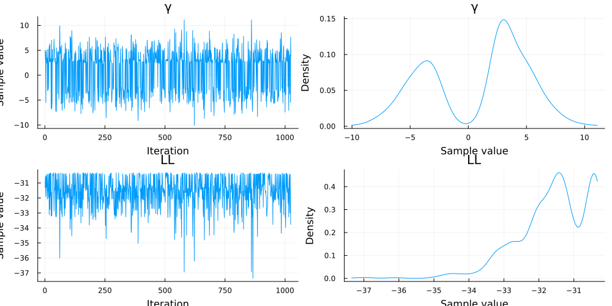

# Parameter Estimation

This brief tutorial explains how to performance Bayesian parameter estimation of the QPDM using [Pigeons.jl](https://github.com/Julia-Tempering/Pigeons.jl). One complication in estimating the parameters of the QPDM is that the posterior distributions may have multiple modes, which leads to convergence problems with most MCMC algorithms. Pigeons.jl uses a special type of parallel tempering to overcome this challenge. An additional advantage of using Pigeons.jl is the ability to compute Bayes factors from the log marginal likelihood using the function `stepping_stone`.

## Load Packages

First, we will load the required packages below. 

```julia
using Pigeons
using QuantumDynamicInconsistencyModels
using Random
using StatsPlots
using Turing
```

## Generate Simulated Data

The next step is to generate some simulated data from which the parameters can be estimated. In the code block below, the utility parameter $\mu_d$ is set to one and the entanglement parameter is set to $\gamma = 2$.  A total of 50 trials is generated for each of the three conditions. The resulting values represent the number of defections per condition out of 50.
```julia
Random.seed!(32)
parms = (
  α = .9, 
  λ = 2,
  w₁ = .5,
  m = .30,
  γ = 2.5
)

outcomes1 = [[2,-1],[6,-3],[3,-1],[7,-2],[-.50,-.75], [2,-3]]
outcomes2 = [[2,-1],[6,-3],[3,-1],[7,-2],[-.50,-.75], [2,-3]]
win_gamble1 = [true, false, true, true, false, true]
ns = fill(100, 6)

model = QDIM(; parms...)
data = rand.(model, outcomes1, outcomes2, win_gamble1, ns)
```

## Define Turing Model

The next step is to define a Turing model with the `@model` macro. For simplicity, we will fix the utility parameter $\mu_d=1$ and set the prior of the entanglement parameter to $\gamma \sim \mathrm{normal}(0,3)$. 

```julia 
@model function turing_model(data, parms)
    γ ~ Normal(0, 3)
    m ~ Beta(1, 1)
    data ~ QDIM(; parms..., γ, m)
end

_data = (outcomes1, outcomes2, win_gamble1, ns, data)
estimator = turing_model(_data, parms)
```

## Estimate Parameters

To estimate the parameters, we need to pass the Turing model to `pigeons`. The second command converts the output to an `MCMCChain` object, which can be used for plotting
```julia
pt = pigeons(
  target = TuringLogPotential(estimator), 
  record = [traces],
  multithreaded = true
)
samples = Chains(sample_array(pt), ["γ", "m", "LL"])
```
The trace of the `pigeon`'s sampler is given below:
```julia
────────────────────────────────────────────────────────────────────────────
  scans        Λ      log(Z₁/Z₀)   min(α)     mean(α)    min(αₑ)   mean(αₑ) 
────────── ────────── ────────── ────────── ────────── ────────── ──────────
        2       1.72        -30      0.585      0.809          1          1 
        4       1.75      -29.9      0.382      0.805      0.923      0.991 
        8      0.996      -29.5      0.688      0.889       0.96      0.996 
       16       1.02      -29.6      0.736      0.887       0.98      0.998 
       32      0.805      -29.1      0.795      0.911       0.99      0.999 
       64      0.907      -29.6      0.794      0.899       0.99      0.998 
      128      0.984      -29.4      0.783      0.891      0.997          1 
      256      0.874      -29.4      0.863      0.903      0.992      0.998 
      512      0.849      -29.4      0.891      0.906      0.993      0.998 
 1.02e+03      0.938      -29.4      0.872      0.896      0.996      0.999 
────────────────────────────────────────────────────────────────────────────
```

## Plot Posterior Distribution 

Now we can plot the posterior distribution of $\gamma$ with `plot`. The posterior distribution of $\gamma$ has a primary mode around 1 and secondary modes around 2 and 3.5.
```julia 
plot(samples)
```

